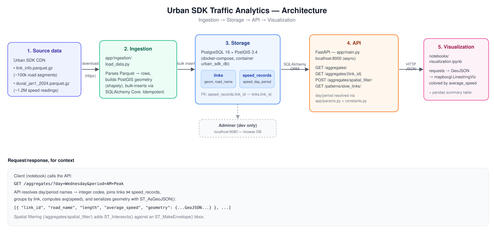

# Urban SDK — Geospatial Traffic Analytics Microservice

A FastAPI microservice that ingests link-level traffic speed data for Duval
County, FL into PostgreSQL/PostGIS and exposes REST endpoints for spatial and
temporal aggregation of road segment speeds — with a companion Jupyter
notebook for Mapbox visualization.

## What's here

- **API** — FastAPI + SQLAlchemy service for querying average speeds per
  road link, filtered by day of week, time-of-day period, and/or a spatial
  bounding box.
- **Data model** — PostGIS-backed `Link` (road segment geometry) and
  `SpeedRecord` (hourly speed observations) tables.
- **Notebook** — pulls aggregated data from the API and renders it on a
  Mapbox choropleth, colored by average speed.
- **Architecture** — diagram of the ingestion → storage → API → visualization
  flow (below).

## Architecture



1. **Source data** — two Parquet files on Urban SDK's CDN: road segment
   metadata/geometry (`link_info`) and hourly speed observations for Duval
   County on 2024-01-01 (`duval_jan1_2024`).
2. **Ingestion** (`app/ingestion/load_data.py`) — downloads both files,
   parses them with pandas/shapely, and bulk-loads them into Postgres.
   Truncate-and-reload, so it's safe to re-run.
3. **Storage** — PostgreSQL 16 + PostGIS 3.4 (via `docker-compose.yml`),
   holding the `links` and `speed_records` tables. Adminer runs alongside
   for local DB browsing at `localhost:8080`.
4. **API** (`app/main.py` + `app/routers/`) — FastAPI service, async
   SQLAlchemy ORM over `asyncpg`, exposing the four endpoints below at
   `localhost:8000`.
5. **Visualization** (`notebooks/visualization.ipynb`) — calls the API with
   `requests` and renders the returned GeoJSON as a Mapbox choropleth
   colored by `average_speed`.

## Setup

Requires [`uv`](https://docs.astral.sh/uv/getting-started/installation/) and
Docker.

All the entry-point scripts live in `bin/`. Everything you need:

```bash
./bin/run.sh
```

Installs dependencies, starts Postgres/PostGIS + Adminer, creates the
schema, loads the data (first run only — subsequent runs detect it's
already there and skip straight to starting the API), and starts the API
in the background. Nothing else to run. Interactive API docs land at
`http://localhost:8000/docs`.

To also see the map, add a free [Mapbox token](https://mapbox.com) to
`.env` (`MAPBOX_TOKEN=...`), then:

```bash
./bin/notebook.sh
```

That opens Jupyter Lab with the notebook ready to go — run all cells.

When you're done:

```bash
./bin/stop.sh
```

Stops the API and the containers; the loaded data is kept, so the next
`./bin/run.sh` comes back up in a couple of seconds instead of reloading
everything.

`bin/setup.sh` is also there on its own if you ever just want the
environment prepared (deps, DB, schema) without loading data or starting
the API — `bin/run.sh` already includes everything it does, so most people
won't need it directly.

## API reference

All endpoints accept `day` as a day name (e.g. `"Wednesday"`) and `period`
as a time-of-day name (e.g. `"AM Peak"`) or numeric id 1–7 — see
`app/constants.py` for the full period table.

| Endpoint | Method | Params | Returns |
|---|---|---|---|
| `/aggregates/` | GET | `day`, `period` | Average speed per link for that day/period |
| `/aggregates/{link_id}` | GET | `day`, `period` | Speed + metadata for one link |
| `/aggregates/spatial_filter/` | POST | body: `day`, `period`, `bbox` | Links intersecting a `[min_lon, min_lat, max_lon, max_lat]` box |
| `/patterns/slow_links/` | GET | `period`, `threshold`, `min_days` | Links averaging below `threshold` mph on ≥ `min_days` distinct days |

## Project layout

```
app/
  main.py            FastAPI app + router registration
  models.py           SQLAlchemy ORM models (Link, SpeedRecord)
  database.py          Async engine/session setup
  config.py             Settings (.env)
  constants.py           Day/period encodings
  params.py                Query-param parsing shared by routers
  routers/
    aggregates.py           /aggregates/*
    patterns.py              /patterns/*
  ingestion/
    load_data.py               Downloads + loads the two datasets
scripts/
  init_db.py           Creates the PostGIS extension + ORM tables
notebooks/
  visualization.ipynb    Mapbox visualization
docs/
  architecture.svg         Architecture diagram
bin/
  setup.sh                  Env + deps + DB + schema, on its own
  run.sh                     Everything: setup + data + API, one command
  stop.sh                     Shuts down the API + containers
  notebook.sh                  Launches the visualization notebook
```
